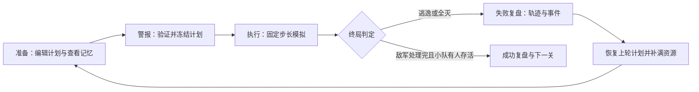

# Ambush Loop 开发方案与蓝图

版本：规划 v1 · 2026-09-07

基线：[PR #4](https://github.com/hailinsu-create/new/pull/4)，已读取元数据与完整差异；核对时为开放草稿，head `c5fefe5d03cc2aea64478bb3a8ab574b9811ed82`。当前工作区未找到游戏仓库，因此没有运行游戏或冒烟测试。本文件是实施方案，所有新增能力、数值和排期均为建议，不代表已完成。

## 1. 产品目标与边界

核心体验：玩家通过一次次失败，把一场混乱的接敌过程改写为可解释、可复现的伏击计划。

每局只验证三个问题：我漏看了什么？这个布置为什么失败？改哪一个决定能够补上缺口？

建议下一版定位为 20–30 分钟可独立体验的垂直切片：3 个短关卡、3 名队员、最多 1 件小队工具、1 种可改变通路的环境互动、完整失败复盘。单次交火目标 20–45 秒，失败后约 5 秒内可回到可编辑计划。以上是试玩目标，需实测调整。

不可破坏的规则：

- 警报响起，位置、朝向、开火条件、工具和环境方案冻结。暂停、变速、镜头及复盘只能改变观看方式。
- 任何存活敌人越过有效逃逸边界，立即失败；参与本次行动的小队全灭也立即失败。
- 跨轮回只留下情报与上轮计划，不留下伤害、弹药、尸体、装备消耗或能力增长。
- 路线和分支由关卡作者定义。环境状态可以选择分支，敌人不会凭空生成新路线。
- 地图、人物、文本、造型、音效和剧情独立创作。

本轮不纳入：战斗中点选指令、自由巡航式队员寻路、任意条件脚本编辑器、随机命中、数值升级树、无限波次、建造经济、程序生成地图、联网、完整战役。

## 2. 基线核查：先解决影响推理的规则

下列结论来自 PR 源码静态阅读，未经运行验证。来源：[代码差异](https://github.com/hailinsu-create/new/pull/4/files)。

| 当前实现 | 对体验的影响 | 首轮处理 |
|---|---|---|
| `enemy.gd` 对警戒后的焦点目标持续扣血，只检查目标是否存活，没有射程/LOS 条件 | 队员可能在敌人已绕到墙后时继续掉血，玩家难以正确利用掩体 | 对还击增加射程、LOS、攻击间隔；失去视线停止射击；用可见射线与受击反馈解释伤害 |
| `operator.gd` 的掩体减伤固定为 0.4 | 各方向受保护程度相同，站位作用不够直观 | P0 先如实显示固定减伤；P2 再给掩体增加保护方向，并显示侧背暴露 |
| 每人 7 发、每发 34 伤害、敌人 100 HP；当前只生成 3 名敌人 | 理论总需求 9 发，总初始弹药 21 发；局部可能断弹，但总量并不紧张 | 用实战日志区分分配问题和总量问题；再调整单关敌人数、每人配弹与射击条件 |
| 每个击杀固定掉 5 发，单人击杀理论消耗 3 发 | 在能连续拾取的布置下，每次击杀可净增 2 发，补给可能削弱资源取舍 | 掉落数量按关卡配置，初始试 0–2 发并只给部分敌人携带；保留稀缺固定补给点的后续空间 |
| 拾取只检查距离，无 LOS/可达性；循环先匹配者先取 | 可能隔墙拾取，归属受队员数组顺序影响 | 保持自动近距离拾取，增加可达/LOS 条件；最近者优先、同距按稳定 ID；显示归属；不引入自主搜尸移动 |
| 重来调用 `_reset_deployments()`；全灭只显示提示，未保存该轮战斗记录 | 改一次射界也要重新部署；全灭没有可操作的新情报 | 默认恢复上轮计划，满血满弹重建；逃逸和全灭都保存轨迹及关键事件 |
| 准备阶段已经画出两条完整固定路线；幽灵线只有空间路径 | 失败可能只增加重复线条，无法解释时间窗口 | 保留已知地图通路，把幽灵升级为带时间的实际行进记录、停顿与受击事件 |
| 拌索可放置判定检查路线离散点，不检查整条线段 | 看似在路上也可能不能放置 | 改为到路线线段的最近距离，并显示合法位置预览；统一用“绊索”文案 |
| 移动、还击及射击分散在 `_process`；出兵使用独立计时器 | 回放一致性、暂停/变速和同帧结算难以约束 | 逐步移到统一固定步长模拟；出兵按模拟 tick 调度 |
| 射击冷却只在有可交战目标时递减 | 没有目标时冷却冻结，再次接敌可能延迟开火 | 明确为时间冷却，在模拟时钟中独立递减 |
| 冒烟脚本遇到任意 FAILED 都打印 `SMOKE_FAIL_ESCAPE`，循环按渲染帧计数 | 标记不能证明失败原因正确；headless 下帧数不等于模拟秒数 | 断言 escape 原因与情报内容；用模拟 tick 或明确模拟时长做超时 |

这些问题要先于装备扩展解决，否则新增系统会建立在玩家无法信任的规则上。

## 3. 一局的完整交互



**准备界面**：地图为主，左侧三张队员卡，右侧选中对象的计划，底部为警报按钮及记忆控件。队员卡显示弹药、武器、部署位、开火规则；地图显示射界、实际 LOS 阴影和掩体保护方向。对未部署队员给出显著提示，但允许沿用当前“至少部署一人即可开始”的规则。

**执行界面**：保留队员卡；显示当前目标、开火、空弹、受击和掉落。提供暂停、1×、2×；不提供任何更改计划入口。玩家可提前终止当前尝试，按失败保存截止时刻的情报并返回准备；不展示未来信息。

**复盘界面**：先突出终局事件，再显示此前关键事件的时间顺序。示例：`8.4 秒：2 号弹药耗尽 → 9.1 秒：侧翼敌人离开其射界 → 12.0 秒：越界`。这是可核实的事件链，系统不要把相关事件武断判定为唯一原因。

点击事件定位对象和画面；拖动时间轴只播放历史记录。幽灵以“第 N 世、记录截止时间”标记，默认只显示最近一次相关路径；可手动对比上一方案。已经记录的历史不因新方案变化而变成未来预测。

普通“再来一次”保留计划和记忆；`R` 沿用清空记忆重开的语义，并清楚标注。提供独立“收回部署”按钮，避免三种操作混淆。

## 4. 系统设计与落地顺序

### 4.1 复盘：先让失败有信息增量

P1 最小记录：对象 ID、模拟时间、位置、存活状态、HP、弹药，以及开火、未能交战的原因变化、击杀、拾取、队员阵亡、逃逸。P2 追加分支选择、门状态变化和开火条件触发。

采用事件日志 + 每 0.1 秒一个轻量表现快照；变化事件单独记录，终局补一帧快照。回放用快照插值和事件定位，不重新执行战斗，不复制完整游戏存档。暂不做任意历史节点分叉重演。

全灭时保留截止时刻所有已观测敌人的轨迹和攻击来源；不补出失败之后的路线。未来若加入战争迷雾，记录层需分开“内部诊断日志”和“允许展示给玩家的情报”。

准备期预览分三层：确定的几何信息、过去实际发生的轨迹、尚未观测的路线行为。不能提前精确模拟整局并显示必胜/必败，否则时间循环失去作用。

### 4.2 战前开火规则：给玩家一个时间决定

每人先只允许选择一种模式：

- 见敌即打：保留当前默认行为。
- 入伏再打：目标进入预先定义的伏击区域后，该队员的开火许可锁存为开启。

开火许可不等于可以穿墙或转向，之后每一枪仍检查存活、弹药、冷却、射程、射界和 LOS。终局及重来清除许可状态。

目标优先级第一版固定为“距逃逸口剩余路径距离最短的合法目标”，同值按稳定敌人 ID；UI 显示该规则。不再同时暴露目标类型、距离、延迟秒数和多条件组合，避免计划面板过重。若试玩证明需要，再加一个可选优先级。

收益：同样的位置和射界，也能通过何时暴露改变接敌节奏；每名队员仍只增加一个低成本决定。

### 4.3 环境与路线：先做一扇门

P2 选择一扇关卡预置的可锁门：准备时选择“保持打开”或“锁闭”；警报后不能操作。关门会封住一条连接边，并使敌人在指定岔口选用作者写好的备用路线。

路线数据是节点和有向边；边包含折线、通行条件、优先级、route ID 和关卡预置后备关系。敌人到决策节点时读取世界状态，选择合法边并记录原因；不做全地图自由寻路，不瞬移，不在半路上来回反复重选。

关卡校验器拒绝“所有出口都被关死且没有后备路线”的配置。锁门会带来代价：绕路增加时间，但敌人从新的方向接近掩体；保留出口侧的威胁。门不能直接成为自动获胜按钮。

炸桶放到候选后续：若核心切片提前稳定，可替换一个工具挑战，但不与门同时首发。需要自动触发条件、范围预览、一次性消耗及友军伤害说明；不提供执行中点击引爆。

### 4.4 队员与装备：先验证一处差异

源码中的机枪手、步枪手、侦察兵当前共享相同参数。P0/P1 可以保留名字，但应让 UI 如实显示能力相同。

P2 可只加入一个单装备槽原型，证明“把有限工具交给谁”会改变方案，例如：一名队员可携带一次性备用弹包，首次空弹后自动补给且本轮不能转交。若这已能制造后勤取舍，先不扩展武器家族。

后续三个角色方向：步枪手负责稳定补漏；支援手用有限连射换取更高消耗和暴露；侦察手用较窄射界和较少弹药换取更远观察/射击距离。所有角色均需有不能包办的任务。具体数值在同一基准场景测定，不能通过单纯把一种角色全属性做高来区分。

小队最多携带 1 件额外工具；关卡预置的门不占工具槽。武器、装备槽和工具预算必须分开显示，避免资源规则歧义。

### 4.5 后勤与掩体

先保留原地近距离自动拾取，加入遮挡检查、唯一归属和稳定分配规则。尸体资源一次性结算；最近队员已达弹药上限时，考虑下一位合法队员；无人可收则留在原处。

掩体增加保护朝向后，攻击方向在保护扇区内才减伤；侧背暴露要在准备预览和受击反馈中一致显示。用格网做 LOS 与方向判定即可，避免一开始引入复杂弹道和穿透。

弹药平衡看“某人在关键时间能否打完关键目标”，而不仅是全队总量。记录每人开枪数、有效命中、空弹时间、拾取量和剩余资源。当前 7 发可作为基线保留，但不能未经测试就认定数值已合适。

## 5. 建议技术蓝图

采用渐进拆分：保留现有场景和单位脚本，先把模拟时钟、结算和日志从 `main.gd` 提取，再抽关卡数据。不要先大规模重写架构。

```text
ambush_loop/
  scenes/main.tscn                 现有入口，逐步瘦身
  scripts/main.gd                  阶段与场景协调
  scripts/operator.gd              队员状态、表现及兼容入口
  scripts/enemy.gd                 敌人状态和表现
  scripts/grid.gd                  LOS/格网几何
  scripts/cover_slot.gd            部署位及保护方向
  scripts/loot_pickup.gd           一次性资源表现
  scripts/mine.gd                  保留文件名，规范绊索行为
  scripts/simulation/combat_sim.gd 固定 tick、调度、规则执行、终局
  scripts/planning/plan_state.gd   可编辑计划与冻结快照
  scripts/replay/battle_log.gd     事件和表现快照
  scripts/replay/intel_store.gd    跨轮回情报，限量保留历史
  scripts/replay/replay_player.gd  独立只读回放
  scripts/level/level_data.gd      Resource 定义与校验入口
  scripts/level/route_graph.gd     作者预设的条件路线
  scripts/level/environment.gd     门等环境状态
  data/levels/*.tres               每关地图/路线/掩体/出兵/工具
  data/equipment/*.tres            武器与装备参数
  tests/                          规则、复盘与每关参考方案
```

最小数据契约：

| 数据 | 关键字段 | 生命周期 |
|---|---|---|
| `LevelData` | level_id、version、几何、cover_defs、route_graph、spawn_schedule、escape_zones、工具预算 | 只读关卡定义 |
| `PlanState` | operator_id、cover_id、facing、equipment_id、fire_mode、工具位置、门方案 | 准备时编辑；警报时验证并深拷贝冻结 |
| `RunState` | run_id、tick、单位状态、资源、出兵游标、门状态、终局原因 | 每次尝试新建 |
| `BattleEvent` | tick、seq、type、actor_id、target_id、position、payload | 按稳定顺序追加 |
| `ReplayRecord` | level_version、plan_snapshot、terminal_tick、events、snapshots | 该次尝试的只读历史 |
| `IntelStore` | level_id、已发现分支、历史记录、上轮计划 | 跨尝试保留；换关隔离；显式重置清除 |

固定模拟建议 60 tick/秒；暂停不推进 tick，2× 每真实秒执行更多同样大小的步，而不是扩大 delta。初版不用随机命中；若后来引入随机项，使用关卡种子及独立 RNG，并记录版本。固定步长本身不能保证任意引擎/平台完全一致，先承诺同一构建与环境内可复现。

每个 tick 的顺序写入规则：处理出兵及环境 → 更新路线选择和移动 → 检查有效越界（越界立即终局）→ 选择目标并解析射击/还击 → 应用伤亡 → 若小队全灭立即失败，否则结算掉落拾取 → 检查成功 → 记录快照。

战斗伤害以 tick 开始时的合法攻击意图汇总后统一应用，允许同 tick 互相击倒；若小队与最后敌人同时全灭，按全灭失败。任何终局只提交一次，之后所有实体停止模拟。

成功条件必须同时满足：出兵日程已耗尽、无存活敌人、零逃逸、至少一名参战队员存活。不能因为场上暂时没人就提前获胜。

终局即使在 tick 中途触发也写入终局事件和快照。所有延时动作绑定 run_id/tick，重来后旧轮回的回调不能复活敌人或更改新局。Resource 定义与 RunState 分离，防止共享资源跨局污染。

存档第一版仅保存关卡完成、设置、上轮计划和有限情报；不保存正在执行的战斗。保留最近 5 次完整记录，重复路径合并为发现事实；为版本不兼容记录提供清除或降级显示策略。

## 6. 三关内容蓝图

| 关卡 | 唯一新增教学点 | 典型失败 | 下一次可执行修正 | 验收 |
|---|---|---|---|---|
| 院子：交叉封锁 | 掩体、射界与主/侧翼的覆盖分工 | 主路被拦，侧翼从射界外通过 | 保留主路队员，仅调整一名队员的位置或朝向 | 无工具也能获胜；玩家能从轨迹说出漏点 |
| 仓道：弹药窗口 | 入伏后开火与稀缺补给 | 过早接敌，关键队员空弹或承受集中还击 | 改开火条件、击杀位置或弹包携带者 | 至少两类有效计划；单纯把火力全堆出口有明确代价 |
| 泵站：关门之后 | 环境状态选择预设备用路线 | 封门后敌人从侧背接近 | 重布保护方向、安排侧翼补漏 | 锁门和不锁门均有可解方案；路线切换可被复盘解释 |

先完成院子改造与一张新关的完整循环，再生产第三关。每关保留一套标准胜利方案、一套指定逃逸方案及一套可控全灭方案用于回归；这些参考答案只用于开发。

环境叙事候选：一次秘密撤离前的封锁行动，队伍依靠有限时间回溯反复校正计划。叙事只解释为什么重来和为什么必须零逃逸，不在切片阶段扩写世界设定、对话系统或过场动画。

## 7. 美术、声音与可读性

先使用色块和原创简化剪影。友军、敌军、历史幽灵除了颜色还需有不同形状、线型和标签；射界用扇形，实际可射范围受墙遮挡，历史轨迹用虚线，当前路径用实体运动表现。

最先补六类反馈：首次开火、敌人开始还击、空弹、补弹、队员阵亡、逃逸。声音与短提示同步，对每个音效控制并发数量。失败时冻结关键画面并标记出口，避免突然弹窗遮住原因。

时间循环视觉可用短暂轨迹倒流和界面色调回退，但实际状态直接重建，不做物理倒放。必须允许跳过重复过渡。

## 8. 开发里程碑与任务切分

排期假设：1 名熟悉 Godot 的开发者全职、持续沿用占位美术、每阶段有少量外部试玩。合计约 19–26 个开发工作日，另留约 20% 缓冲，日历上按约 5–7 周安排；这是规划估算，不是完成承诺。多人可以并行制作内容和界面，但核心规则仍有依赖顺序。

| 阶段 | 工作量 | 交付 | 退出条件 |
|---|---:|---|---|
| P0 规则可信 | 3–4 日 | 还击 LOS/射程、冷却、绊索线段判定、拾取归属、计划保留、严格终局、固定模拟骨架 | 既有胜/败场景通过；隔墙不还击/不拾取；重来无脏状态 |
| P1 失败可读 | 5–7 日 | 事件日志、全灭记忆、时间轴、对象定位、暂停/变速、历史分层 | 相同计划可复现；播放器不改战斗；5 名试玩者中至少 4 名能解释最近一次失败并提出修改 |
| P2 计划有变化 | 6–8 日 | 开火条件、门和备用路线、方向掩体、一件装备原型、第二关 | 规则能改变胜负；备用路线可复盘；第二关有两类有效解法 |
| P3 切片交付 | 5–7 日 | 第三关、引导、反馈、保存、导出与试玩调优 | 新玩家可独立完成；三关回归通过；主要失败原因可读 |

建议按以下 PR 拆分，每个 PR 保持当前院子可运行：

1. `规则与回归`：先补针对现有问题的回归场景，再修还击、拾取、绊索和终局。
2. `计划与轮回重置`：抽 PlanState；保留部署与朝向；统一新局初始化和 run_id。
3. `统一模拟时钟`：迁移移动、出兵、冷却、伤害与终局；完成一致性检查。
4. `事件与复盘`：先事件列表，再快照时间轴；覆盖逃逸和全灭。
5. `战前开火条件`：一个新模式与可见触发反馈，不加入自由脚本。
6. `关卡数据与环境分支`：先把现有院子无行为变化地外置，再添加门和第二关。
7. `掩体与装备`：方向保护、一次性弹包、有限后勤参数及第二关平衡。
8. `三关切片`：第三关、引导、存档、导出和真人试玩修订。

## 9. 验证与验收矩阵

引擎以项目声明的 Godot 4.7 为基线，落地时记录实际 `godot --version` 并在本地与 CI 固定相同构建。此处未验证该版本安装或运行可用性。

保留入口：

```bash
godot --path ambush_loop
godot --headless --path ambush_loop -s res://scripts/smoke_test.gd
```

原冒烟需继续依次产生 `SMOKE_FAIL_ESCAPE`、`SMOKE_OK`，但输出前加入失败原因、幽灵记录、轮回次数与参战状态的真实断言。不能只靠日志字符串判定通过。

| 测试域 | 必须覆盖的行为 |
|---|---|
| 不可微操 | 执行阶段鼠标、快捷键、按钮和方法入口都不能修改冻结计划；暂停/变速不改变计划 |
| 终局 | 任意逃逸立即失败；小队全灭失败；同时全灭按失败；等待出兵时不能提前成功；结果只发一次 |
| 几何与还击 | 射界边界、射程边界、墙体遮挡、断开 LOS、恢复 LOS；方向减伤与可见预览一致 |
| 资源 | 每枪恰扣一发；零弹不射击；尸体只能领取一次；隔墙不能取；多人同距归属稳定 |
| 重置 | 满血满弹、旧尸体消失、门重置、旧出兵任务失效；记忆保留；显式清记忆才删除 |
| 一致性 | 同关同计划同构建运行 10 次，终局与关键事件 tick 相同；1×、2×和暂停恢复一致 |
| 复盘 | 首尾状态对应；事件定位准确；只展示截止终局的信息；拖动不触发战斗逻辑 |
| 路线 | 门开/闭选择正确分支；未到决策点不反复切线；无非法边、穿墙线段或不可达出口 |
| 关卡 | 每关参考胜利、逃逸和全灭方案；至少两类解法由可执行计划验证，不仅靠设计推测 |
| 导出试玩 | 正常窗口操作、缩放可读、文字不裁切；导出包可启动、重来和保存；目标硬件上观察性能 |

用模拟 tick 上限作为无人值守测试护栏。对于“最后一枪和越界同 tick”的规则，按第 5 节顺序，移动后已越界则失败，后续射击不能挽回。

## 10. 试玩记录与停止扩展条件

每次试玩记录：首次警报耗时、失败原因、轮回次数、两次方案改了什么、是否查看复盘、下一次是否修正已知漏点、每人弹药/受伤曲线、通关时间。优先用本地日志和现场观察，无须先接入远程分析服务。

第一轮 5–8 人只作方向性验证，不能当统计结论。建议内部目标：大多数人 2 分钟内开始第一局；5 人至少 4 人能指出失败的具体位置或时机；第一关多数人在 2–5 次有效尝试后过关；没人需要靠执行阶段救场。目标未达成时先修引导与反馈，不能用加装备掩盖。

四个常见偏航与应对：

- 只剩“把人摆在出口”：调整视线、接敌方向和保护代价，让前沿、后勤、出口之间存在选择；避免简单抬高血量。
- 重来只是重复劳动：恢复上轮计划、允许局部修改、缩短过渡、明确显示改了什么。
- 玩家称失败为随机或作弊：先检查帧顺序、隐性还击、拾取归属和路线切换反馈。
- 所有失败都靠补弹解决：减少通用补给，增加位置与时机的互相制约。

若 P1 之后玩家仍无法从失败中提出下一步修改，暂停关卡和装备扩展，集中修复复盘；若玩家能解释却觉得无趣，优先试“入伏再打 + 门改变侧翼”这一组战前决定。

最终切片的交付标准是：玩家能看到计划如何成立，也能从失败中找到下一次可验证的修改。功能数量服务于这一标准。
