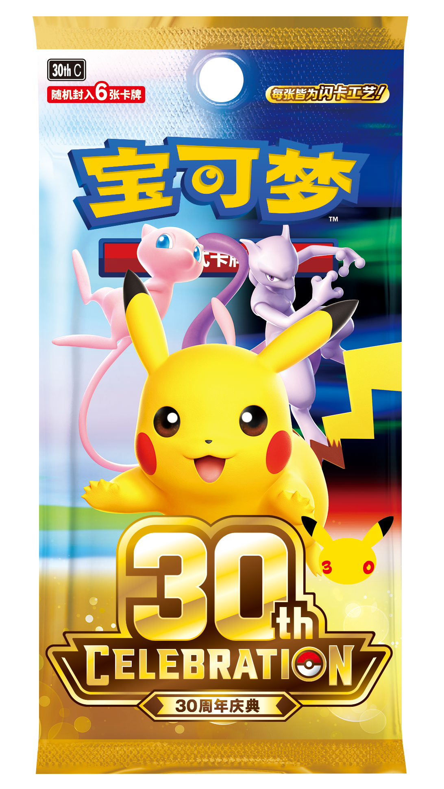
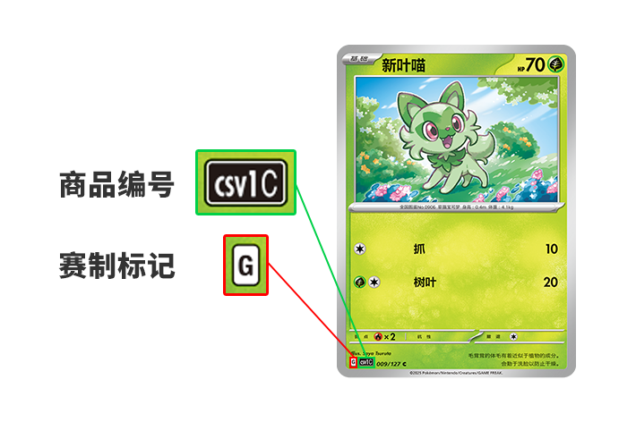
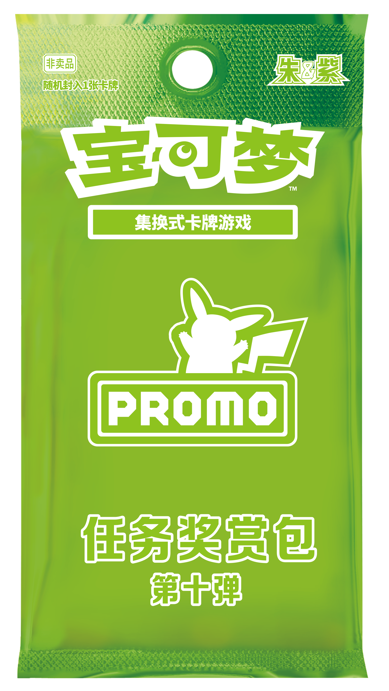

# 开卖当天先进店核三样：18元全闪包、左下角字母、券窗并不齐开

魔可梦，专门拆解宝可梦卡牌的产品、赛事与流通变化。

## 先说结论

今天（2026-09-16，周三）简中「30周年庆典」开卖。走进店或打开小程序，先核三样，不要把三件事挤成「开卖就全部到手」：

1. **补包能买，但 18 元是建议零售价。** 宝可梦中国官网商品页写明建议零售价 **18元/包**（人民币、官网口径，核验 2026-09-16），每包 **6 张闪卡、且均为闪卡**，每包必入 30 种皮卡丘闪之一。官网现文**没有写限购，也没有写库存**。店头价、是否有货，以当场为准。
2. **赛制加 J，不退 G；复刻能不能打，回赛制页。** 8 月 24 日公告：自今天起标准赛可用 **G/H/I/J**。本稿核验时，官网「赛制」页更新日期仍是 **2026-08-07**，正文仍写 G/H/I。30 种历史特别式样复刻**不要默认今天就能进标准赛卡组**。
3. **特典换挡开始，窗口并不齐开。** 任务奖赏包第十弹兑换窗 **今天开（9/16–11/30）**；活动特别包第五弹小程序兑换窗 **9/21–11/30**（每周任务 9/21 更新、每月任务 10/1 更新）；活动奖赏包第五弹仅道馆、送完即止、**官网现文未写券兑换窗**。

反常识：**发售日 ≠ 把三弹特典券一天兑完。** 日本 Mercari 与宝可梦公司合作，自发售日 0:00 起临时禁止未开封「30th CELEBRATION」扩展包等挂牌（单卡仍可卖）——这是海外二手平台在打黄牛/封盒炒作，**不等于简中店里货一定够**，也不构成投资建议。

收藏品价格波动大，本文不构成投资建议。

## 走进店：先验包装上写了什么，再决定拆不拆

官网把今天定位为全球同步发售日（部分地区除外），同时又写明：受时差、物流等因素影响，**具体发售时间可能会略有差异**。所以今天进店，第一件事不是「一定能买到」，而是**先验这包是不是官网写的那包**。

宝可梦中国官网商品页（核验 2026-09-16）写明：

| 口径 | 官网现文 |
| --- | --- |
| 商品名 | 宝可梦集换式卡牌游戏 补充包 30周年庆典 |
| 发售日 | 2026年9月16日（周三） |
| 建议零售价 | 18元/包（人民币，官网建议零售价；不是电商实时价、不是二手价、不是店头承诺价） |
| 商品内容 | 6张闪卡；卡牌随机封入 |
| 工艺 | 所有卡牌均为闪卡 |

对拆包的人，同一页还写了两件「每包就能碰到」的事：

- **每包必入** 30 种不同插画皮卡丘闪卡中的 1 张。
- 新稀有度 **FUR** 登场，插画由平面艺术家 YOSHIROTTEN 创作。

进店时可以对包装上的两句：

- 「随机封入6张卡牌」
- 「每张皆为闪卡工艺」

建议零售价 **不印在包装主图上**，以该页表格「18元/包」为准。店里要是报价、限购、套装捆绑跟官网表格不一致，以当场规则为准——官网现文没有替你写限购，也没有替你保证货架上有。

图源：宝可梦中国官网《补充包「30周年庆典」将于9月16日（周三）发售！》，https://www.pokemon.cn/tcg/product/22237.html ，引用日期 2026-09-16。包装图可见「随机封入6张卡牌」「每张皆为闪卡工艺」「30周年庆典」；建议零售价以该页表格「18元/包」为准。

**市场边界一：同一天的包，三国写的不是同一句话。**

| 地区 | 口径（官网现文） | 对普通玩家 |
| --- | --- | --- |
| 简中 | 6 张闪卡，均为闪卡；每包必入 30 种皮卡丘之一。**未写**每包必入基本能量 | 买简中包，只按简中页验 |
| 日版 | 希望小売価格 360円（税込）；キラカード 6 枚；**各パックにつき1枚、基本エネルギーが確定で封入** | 日版多写了「必入能量」，简中页没有这句，不套用 |
| 美版 | 每包 5 张闪卡（含 30 种皮卡丘之一）再加 1 张闪基本能量 | 美版是 5+1，不是简中的 6 张全闪 |

买简中包，不要拿日版「必入能量」或美版「5 闪 + 1 能量」当验货标准。

**对普通玩家意味：** 若你要的是「一包里必有一张皮卡丘闪 + 全闪手感」，按官网建议零售价拆，是消费决定。若你要的是某一张 FUR 或某一张历史复刻，发售后单卡流通是另一套价格，本稿不预测、不写必涨。店里没货，也不等于「官方没开卖」。

## 拆开以后：先看左下角，别把复刻直接塞进标准赛

今天第二件要核的，是**卡组字母**，不是「开卖了所以包里每张都能打」。

宝可梦（上海）玩具有限公司 2026 年 8 月 24 日公告《关于宝可梦卡牌标准赛制调整的说明》：

- **至 2026 年 9 月 15 日**：只可使用赛制标记为 **G、H、I** 的卡牌，以及 8 种基本能量卡，**和其他官网「赛制」页面列举的可在标准赛制中使用的卡牌**。
- **自 2026 年 9 月 16 日开始**：只可使用赛制标记为 **G、H、I、J** 的卡牌，以及 8 种基本能量卡。

对照 2026 年 6 月 27 日那次说明（配合 7/16「共逐荣光」）：7/15 为止是 F/G/H，7/16 起变成 G/H/I，**并写明 F 无法在标准赛使用**。这一次 9/16 **没有写「G 不能用」**，只是把 J 加进来。

所以今天进店打标准赛的人：**G 标卡按公告现文仍在。** 不要为了「庆典开卖」把 G 清出卡组。

还要注意两处不等宽，今天尤其容易踩：

1. **公告已经写 GHIJ，赛制页未必已经改文。** 官网「赛制」页本稿核验时更新日期仍是 **2026-08-07**，标准赛正文仍写「赛制标记为 G、H、I 的卡牌和 8 种基本能量卡，以及以下所列举的卡牌」，列举名单仍是 30th-P 御三家特典和「皮卡丘」（PROMO_001/M-P）等。你读到本文时如果该页已改，以届时现文为准；**在它改文之前，不要用「我看见别人打了 J」代替自己核页。**
2. **8/24 公告 9/16 那句没有重复「以及其他官网赛制页面列举的卡牌」。** 9/15 那句带着列举卡从句，9/16 那句只写了 G/H/I/J 和 8 种基本能量。这些列举卡今天是否仍保留，**只看赛制页届时现文**，本稿不补写。

单卡怎么认：看左下角「赛制标记」和「商品编号」。官网赛制页用「新叶喵」做了示意图——绿框是商品编号，红框是赛制标记 **G**。今天拆开庆典包，也是看这个位置，**不要默认每张都是 J**。

图源：宝可梦中国官网「赛制」页，https://www.pokemon.cn/tcg/rules/regulation/ ，引用日期 2026-09-16。示意图以「新叶喵」为例，标出左下角商品编号与赛制标记 G。该页核验时更新日期仍为 2026-08-07，标准赛正文仍列 G/H/I。

历史特别式样复刻是今天第三件容易想当然的事。简中商品页写了 30 种「象征 30 年历史」的特别式样，举例包括「宝可梦集换式卡牌游戏」系列的喷火龙，以及「太阳&月亮」系列的皮卡丘&捷克罗姆GX，并钉了两条注释：

- 这些特别式样**能否在标准赛制中使用，请参考官网「赛制」页面**；
- **在可使用其原版卡牌的赛制中，可以使用这些卡牌。**

日版 30 周年站现文写得更硬：特别式样复刻**均不可用于现行标准赛**；原版能用的赛制里这些卡可以用来。简中商品页**没有照抄「均不可用于现行标准赛」**，而是把「能不能用」指向赛制页。本稿**不把日版结论套到简中**，也不提前宣判。今天拆到复刻，动作只有一个：打开赛制页，核这张卡有没有被写进去。

**对普通玩家意味：** 今天多一个字母可用，不等于旧卡组作废，也不等于庆典包里每张都能打标准赛。好看的复刻，先当收藏或开放赛制材料，标准赛资格以赛制页为准。

## 打开小程序 / 走进道馆：今天能做的，和还不能做的

官网《全新特典卡登场，最新信息一篇全掌握！》写明，2026 年 9 月 16 日起训练家会见到三弹新特典包。今天的行动不是「把三弹兑完」，而是**按通道分开做**：

| 特典包 | 今天能做什么 | 官网写明的兑换 / 发放边界 |
| --- | --- | --- |
| 朱&紫 活动特别包 第五弹 | 道馆活动现场问有没有第五弹；小程序每周/每月任务**还没切到这一弹** | 小程序兑换有效期 **2026-09-21—2026-11-30**；每周任务 9/21 更新、每月任务 10/1 更新；道馆 9/16 起可发，送完即止 |
| 朱&紫 活动奖赏包 第五弹 | **只**能去道馆问这场活动怎么发 | 9/16 起可通过参加活动获得；送完即止；获取方式以道馆活动实际规则为准。**官网现文未给出券兑换有效期** |
| 朱&紫 任务奖赏包 第十弹 | 小程序任务（启航 / 每周 / 每月 / 生涯）；**今天可以开始兑券** | 兑换有效期 **2026-09-16—2026-11-30** |

两件今天最容易做错的事：

1. **打开小程序就把三弹点一遍。** 任务奖赏包第十弹的券窗口从今天开；活动特别包第五弹的券窗口从 **9/21** 才开，因为每周任务要到 9/21 才更新到这一弹。按官网现文，今天兑不完「所有第五弹」。
2. **把道馆现场包当成小程序兑换券。** 活动奖赏包第五弹只走线下道馆，官网没给它写一串「兑换有效期」。物流还可能造成各道馆到货时间差异。去店里问的是「第五弹到了没有、这场活动怎么发」，不是「券是不是今天到期」。

小程序路径仍是：卡牌会员「任务中心 → 奖励中心」拿券 → 会员商城用券。任务奖赏包可快递或自提，活动特别包走快递。两个小程序要用同一手机号登录，并在会员商城完成「绑定卡牌会员小程序」。选择快递可能另付邮费，以商城页为准。官网写明：具体库存情况请以实际情况为准。

图源：宝可梦中国官网《全新特典卡登场，最新信息一篇全掌握！》，https://www.pokemon.cn/tcg/other/23657.html ，引用日期 2026-09-16。该包可通过道馆活动或小程序每周/每月任务获得；小程序兑换有效期 2026-09-21—2026-11-30。包装标「非卖品」「随机封入1张卡牌」。

图源：同上页，https://www.pokemon.cn/tcg/other/23657.html ，引用日期 2026-09-16。该包仅可通过「宝可梦卡牌会员」小程序任务获得，兑换有效期 2026-09-16—2026-11-30。包装标「非卖品」「随机封入1张卡牌」。**这是今天小程序里真正开窗的那一弹。**

**对普通玩家意味：** 今天小程序优先把两个号绑好、把第十弹的券路径走通；第五弹特别包的券等到 21 号。打道馆的人今天问第五弹到货和本场发放规则，不要默认「开卖日每家店都有、都能发完」。

## 海外对照：禁封盒挂牌，不等于简中货一定够

日本二手平台 Mercari 2026 年 9 月 16 日新闻稿写明：基于「市场基本规则」以及与株式会社宝可梦的合作，自 **2026 年 9 月 16 日 0:00** 起，在「无法确保安心、安全交易环境」的期间内，禁止在 Mercari / Mercari Shops 出品「30th CELEBRATION」相关商品。现文划的范围是：

- **未开封**的扩展包「30th CELEBRATION」禁止挂牌；
- 「30th CELEBRATION カードセット」（全 9 种）**开封、未开封都禁止**；
- **已开封的单卡可以卖**；
- 含上述商品的套装出售也禁止；
- 禁止期间：2026-09-16 0:00 起，直到平台判断可以确保安心、安全的交易环境。

英文媒体 PokéBeach 转述同一条新闻稿，把政策概括为「自发售日起临时禁止封盒 30th 商品挂牌，单卡仍可卖」。本稿以 Mercari 日文现文为准；PokéBeach 只作英文转述对照。

这是海外对照要留下的一句：**官方在打黄牛和封盒炒作，不等于简中店里货一定够，也不构成投资建议。** 简中官网商品页没有写限购、没有写铺货量；特典页只写了道馆「送完即止」和「因物流运输原因，各道馆可能存在到货时间差异」。把日本平台禁挂牌读成「国内一定好买」，是另一类想当然。

日版资讯站（pokemon-card.com/info/）9 月条目可见扩展包「30th CELEBRATION」收载卡公开、周边商品 9/16 发售等，**没有**把 Mercari 禁挂牌写进官方资讯列表。海外二手平台政策，不要当成简中赛制或简中铺货公告。

## 可保存清单

核验日期：2026-09-16。口径：宝可梦中国官网现文（海外对照另标来源）。时区：Asia/Shanghai。

- [ ] **进店先验包装。** 商品名应对「补充包 30周年庆典」。包装可对「随机封入6张卡牌」「每张皆为闪卡工艺」。官网建议零售价 **18元/包**（人民币，官网口径）。官网现文**未写限购、未写库存**；物流可能导致到货时间差异。
- [ ] **每包必入 30 种皮卡丘闪之一；新稀有度 FUR。** 30 种历史特别式样复刻能否进标准赛 → 只看赛制页，不提前当 J 标用。
- [ ] **赛制：今天起 G/H/I/J，加 J 不退 G。** 8/24 公告已写；赛制页核验时更新日期仍为 2026-08-07，正文仍写 G/H/I。单卡看左下角赛制标记，不要默认庆典包每张都是 J。G 先别清出卡组。
- [ ] **任务奖赏包第十弹：** 仅小程序任务；兑换窗 **9/16–11/30**。**今天可以兑。**
- [ ] **活动特别包第五弹：** 道馆或每周/每月任务；小程序兑换窗 **9/21–11/30**。每周任务 9/21 更新，每月任务 10/1 更新。道馆 9/16 起可发，送完即止。
- [ ] **活动奖赏包第五弹：** 仅道馆；9/16 起可发，送完即止。官网现文**未写券兑换窗**，不要编一个。
- [ ] **发售日 ≠ 一天兑完所有券。** 两个小程序同一手机号 + 完成绑定。快递可能另付邮费。日 Mercari 禁未开封 30th 扩展包挂牌 ≠ 简中货一定够。18 元是建议零售价。不写必涨、不写抄底、不写闭眼入。

## 相关阅读

以下两篇与「资格 / 窗口 / 别把开卖当成已经到手」同一类问题，请从公众号主页搜索标题（无微信链接，不编造）：

- 发售前夜先分三套日历：18元全闪包、加J不退G、特典窗口并不齐开
- 简中PTCG城市赛第四赛季开赛前夜：中选不是入场券，核销才是

## 下一篇

发售后回看三件事：官网「赛制」页有没有把 J 写进去、30 种特别式样复刻有没有出现在列举名单、各道馆活动特别包 / 奖赏包第五弹实际到货差异。

如果你想在简中PTCG产品发售、退环境和赛事规则变化时，第一时间知道「这件事对普通玩家意味着什么」，可以关注魔可梦。

收藏品价格波动大，本文不构成投资建议。

## 文末参考资料

1. 宝可梦中国官网《补充包「30周年庆典」将于9月16日（周三）发售！》，https://www.pokemon.cn/tcg/product/22237.html ，核验 2026-09-16。建议零售价 18元/包；6张闪卡；全闪；FUR；30 种皮卡丘必入其一；30 种特别式样复刻及赛制注释；时差/物流可能导致发售时间略有差异。
2. 宝可梦中国官网《全新特典卡登场，最新信息一篇全掌握！》，https://www.pokemon.cn/tcg/other/23657.html ，核验 2026-09-16。三弹特典、兑换窗、每周/每月任务更新日期、道馆送完即止与物流差异、小程序兑换路径。
3. 宝可梦中国官网《关于宝可梦卡牌标准赛制调整的说明》（2026-08-24），https://www.pokemon.cn/tcg/other/23520.html ，核验 2026-09-16。9/15 止 G/H/I；9/16 起 G/H/I/J。
4. 宝可梦中国官网「赛制」页（更新日期 2026-08-07），https://www.pokemon.cn/tcg/rules/regulation/ ，核验 2026-09-16。本稿截稿时标准赛仍列 G/H/I 及列举卡；9/16 后以该页届时现文为准。
5. 宝可梦中国官网「集换式卡牌游戏」资讯列表，https://www.pokemon.cn/category/tcg ，核验 2026-09-16。头条可见城市赛第四赛季第三批报名（2026-09-14）等；主选题官网页仍有效，未改写城市赛。
6. 宝可梦中国官网《关于宝可梦卡牌赛制调整的说明》（2026-06-27），https://www.pokemon.cn/tcg/other/22563.html ，核验 2026-09-16。7/16 进 I 退 F 的对照。
7. 日版对照：ポケモンカードゲーム30周年特别站「30th CELEBRATION」商品页，https://www.30th.pokemon-card.com/product/m6a ，核验 2026-09-16。日版写 6 张闪卡、希望小売価格 360円（税込）、每包必入 1 张基本能量；特别式样复刻「现行标准赛不可使用」。简中不直接套用。
8. 日版资讯列表：https://www.pokemon-card.com/info/ ，核验 2026-09-16。可见 9/16 发售相关商品资讯；未将 Mercari 禁挂牌写入该列表。
9. 美版对照（机制/产品矩阵，不作为简中购买口径）：Pokémon.com《Pokémon TCG: 30th Celebration Product Showcase》，https://www.pokemon.com/us/news/pokemon-tcg-30th-celebration-product-showcase ，核验 2026-09-16。美版写 5 闪 + 1 闪基本能量。
10. Mercari 新闻稿《メルカリ、9月16日より「ポケモンカードゲーム 30th CELEBRATION」関連商品の出品を禁止》，https://about.mercari.com/press/news/articles/20260915_principles/ ，核验 2026-09-16。自 9/16 0:00 起临时禁止未开封扩展包等挂牌；单卡可卖；卡片套装开封与否均禁止。
11. 英文转述：PokéBeach《Mercari and Pokemon Target Scalpers By Banning Listings of Sealed “30th Anniversary” Products》，https://www.pokebeach.com/forums/threads/mercari-and-pokemon-target-scalpers-by-banning-listings-of-sealed-%E2%80%9C30th-anniversary%E2%80%9D-products.157043/ 及对应正文 https://www.pokebeach.com/2026/09/mercari-and-pokemon-target-scalpers-by-banning-listings-of-sealed-30th-anniversary-products ，核验 2026-09-16。以 Mercari 日文现文为准。
